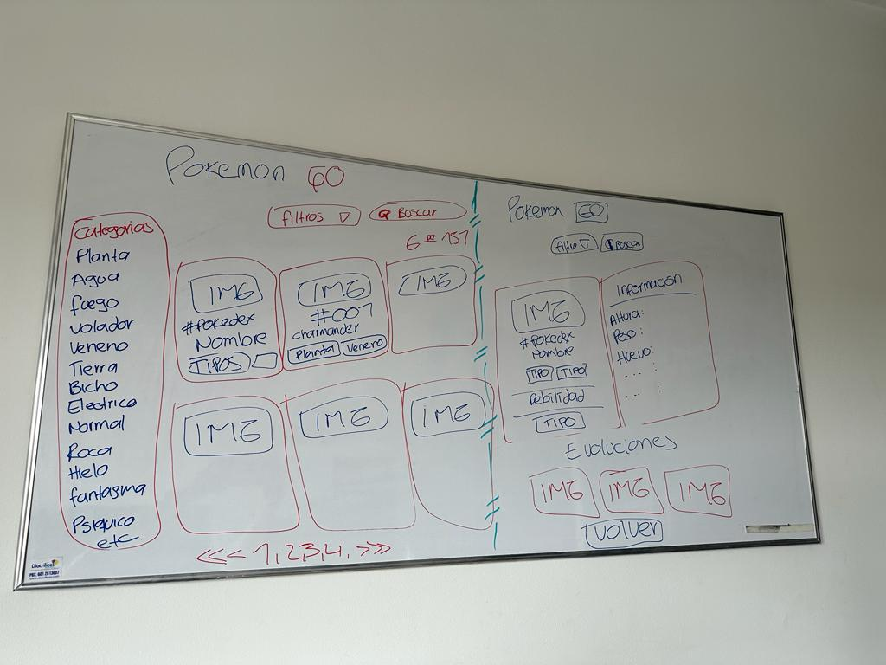
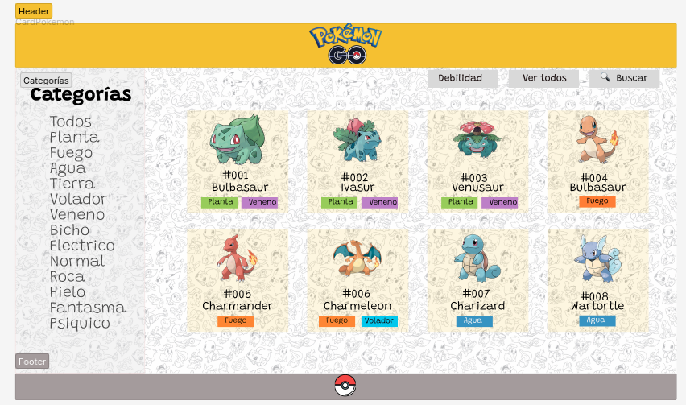
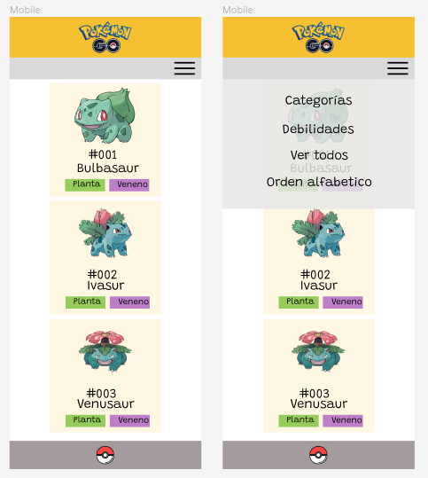
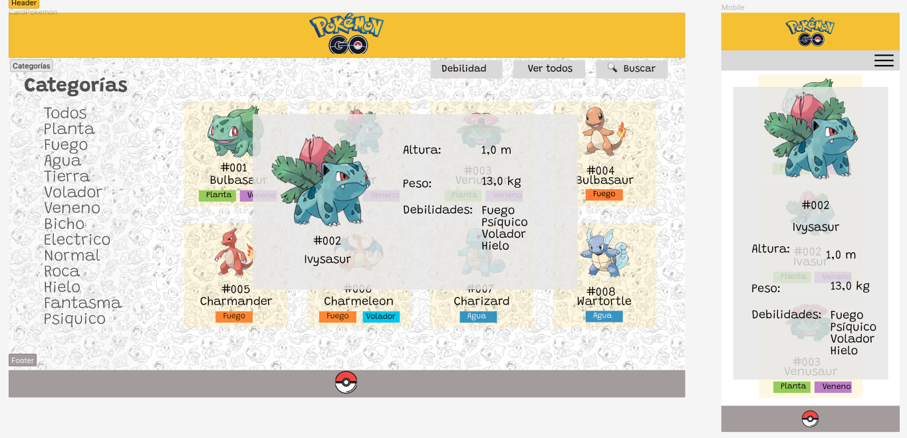

# Pokémon

## Índice

- [Pokémon](#pokémon)
  - [Índice](#índice)
  - [Descripción general del proyecto](#descripción-general-del-proyecto)
  - [Objetivo de la página](#objetivo-de-la-página)
  - [Usuario objetivo](#usuario-objetivo)
  - [Historias de usuario](#historias-de-usuario)
  - [Requerimientos](#requerimientos)
  - [Prototipo de baja fidelidad](#prototipo-de-baja-fidelidad)
  - [Prototipo de alta fidelidad](#prototipo-de-alta-fidelidad)
  - [Test](#test)

## Descripción general del proyecto

En está página encontrará los datos de los pokémones de las legiones Kanto y Johto necesarios para convertirse en un gran maestro Pokémon. Contiene las características esenciales para emprender en el mundo de los entrenadores obteniendo información de los pokémones que desea capturar, criar, entrenar y cuidar, hasta el momento que estén listos para combatir. Podrá encontrar los personajes mediantre filtros como:
- Ordernar por número de pokedex
- Orden alfabético
- Categorías
- Debilidades

***
## Objetivo de la página
Permitir al usuario encontrar la informaición que necesita de manera fácil e intuitiva, mediante filtros, categorías, debilidades, número de pokedex.
***
## Usuario objetivo
Personas que deseen ser entrenadores Pokémon.
Entrenadores Pokémon que deseen encontrar información útil, ágil de las legiones Kanto y Johto.

***
## Historias de usuario
**Historia uno**
- Rol de usuario: Entrenador Pokémon.
- Objetivo: Conocer todos las categorías de los pokémones Kanto y Johto.
- Criterio de aceptación: Ver todas las categorías de pokémon.

**Historia dos**
- Rol de usuario: Entrenador Pokémon.
- Objetivo: Conocer todos las debilidades de los pokémones Kanto y Johto.
- Criterio de aceptación: Ver todas las debilidades de pokémon.

**Historia tres**
- Rol de usuario: Entrenador Pokémon.
- Objetivo: Conocer el tipo de cada pokémon.
- Criterio de aceptación: Ver listado de los pokémones y los tipos de cada uno.

**Historia cuatro**
- Rol de usuario: Entrenador Pokémon.
- Objetivo: Encontrar los pokémones en orden alfabético.
- Criterio de aceptación: Ver listado de los pokémones en orden de la a-z y z-a.

## Requerimientos

**Requerimientos**
- Filtrar pokémones según su número de Pokédex
- Filtrar pokémones por categoría de Pokémon
- Filtrar pokémones por debilidades de Pokémon
- Seleccionar Pokémon específico
- Ver información detallada del Pokémon seleccionado.
- Mostrar información sobre las debilidades de cada Pokémon.

## Prototipo de baja fidelidad

## Prototipo de alta fidelidad
- Vista principal en desktop

- Vista principal mobile

- Vista cuando se le da clic en un pokémon

## Test
Se realizaron pruebas unitarias para filtrar las categorias, las debilidades y para ordenar de la A a la Z los nombres de los pokemones. 

 PASS  test/data.spec.js
  filterType
    ✓ es una función (1 ms)
    ✓ deberia de retornar un array de objetos de pokemones del tipo Fuego (1 ms)
  filterWeaknesses
    ✓ Es una función
    ✓ deberia de retornar un array de objetos con pokemones con debilidades de fuego
  order
    ✓ Es una función
    ✓ deberia de retornar un array de objetos por orden alfabetico (1 ms)

--------------|---------|----------|---------|---------|-------------------
File          | % Stmts | % Branch | % Funcs | % Lines | Uncovered Line #s 
--------------|---------|----------|---------|---------|-------------------
All files     |   93.75 |      100 |   85.71 |     100 |                   
 src          |   93.33 |      100 |   85.71 |     100 |                   
  data.js     |   93.33 |      100 |   85.71 |     100 |                   
 test         |     100 |      100 |     100 |     100 |                   
  mockData.js |     100 |      100 |     100 |     100 |                   
--------------|---------|----------|---------|---------|-------------------